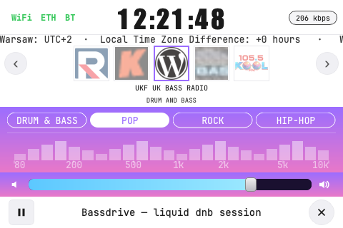
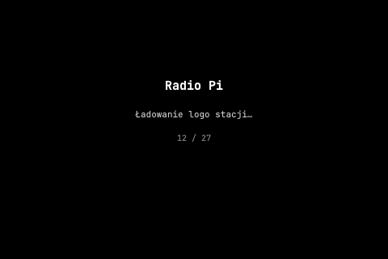
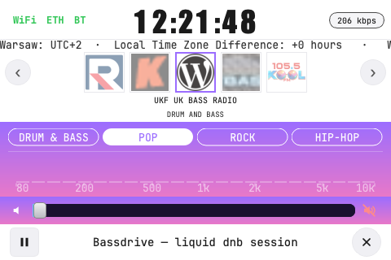
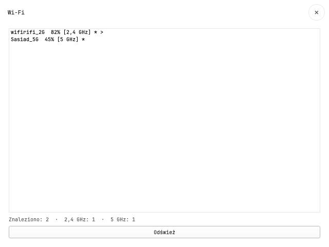

# Radio Pi

Internet radio kiosk for **Raspberry Pi 3 Model B** with **Waveshare 3.2" RPi LCD (B)** (480×320, SPI, `waveshare32b`).

Light UI built with Python 3 + PyQt5. Audio via `mpv`. Network via NetworkManager (`nmcli`). Real-time spectrum equalizer via PulseAudio + numpy.



## Features

- **27 curated stations** (DnB, Polish, international) with logo cache and splash screen
- **EQ presets** (Pop, Rock, DnB, Hip-Hop, …) + live spectrum visualizer
- **Mute/unmute** on speaker icon — slider sync, equalizer pause/resume
- **Remember last station** across restarts (`app/data/last_station.json`)
- **WiFi / Ethernet / Bluetooth** configuration overlay
- **VLC pendrive** shortcut with full codec support
- **Health check** and maintenance scripts

| Screen | Preview |
|--------|---------|
| Splash |  |
| Playing |  |
| Muted |  |
| WiFi menu |  |

## Hardware

| Component | Details |
|-----------|---------|
| Board | Raspberry Pi 3 Model B (1 GB RAM) |
| Display | Waveshare 3.2" RPi LCD (B) — ILI9341 + ADS7846 touch |
| Audio | 3.5 mm jack (`pulse/alsa_output.platform-bcm2835_audio.analog-stereo`) |
| WiFi | **2.4 GHz only** (BCM43143) |

## Quick deploy (existing Pi on LAN)

```bash
PI_HOST=192.168.0.81 ./build/deploy-to-pi.sh
```

Or incremental sync:

```bash
rsync -az --exclude .venv --exclude .git radio-pi/ pi@192.168.0.81:/opt/radio-pi/
ssh pi@192.168.0.81 'sudo systemctl restart radio-ui.service'
```

## Maintenance & health check

On the Pi:

```bash
# Audit only (no changes)
bash /opt/radio-pi/build/health-check-pi.sh

# Cleanup + VLC codecs (does NOT restart radio)
sudo /opt/radio-pi/build/pi-maintenance.sh
```

## Golden SD image

Full system clone (OS + apps + settings) for flashing new SD cards:

```bash
sudo OUTPUT_DIR=/media/pi/USB /opt/radio-pi/build/export-golden-image.sh
```

See [docs/GOLDEN_IMAGE.md](docs/GOLDEN_IMAGE.md) for details.

## OS setup (from scratch)

**Raspberry Pi OS Legacy Bullseye 32-bit** — Raspberry Pi Imager → *Raspberry Pi OS (other)* → *Legacy Lite*, then desktop + LCD driver.

### LCD driver

```bash
sudo apt-get install -y git unzip cmake
git clone https://github.com/waveshare/LCD-show.git
cd LCD-show && chmod +x LCD32-show && sudo ./LCD32-show lite
sudo reboot
```

### Application

```bash
sudo apt-get install -y mpv python3-pyqt5 python3-pyqt5.qtsvg python3-pil \
  python3-numpy pulseaudio-utils network-manager socat
sudo mkdir -p /opt/radio-pi && sudo chown pi:pi /opt/radio-pi
# copy project to /opt/radio-pi, then:
cd /opt/radio-pi
pip3 install -r requirements.txt
python3 build/fetch_stations.py
python3 build/fetch_station_logos.py
sudo bash build/install-autostart.sh
sudo bash build/install-vlc-media.sh
```

## Autostart

```bash
sudo cp systemd/radio-ui.service /etc/systemd/system/
sudo systemctl daemon-reload
sudo systemctl enable --now radio-ui.service
```

`radio-hotspot.service` is **disabled by default** when WiFi is configured (avoids boot errors).

## Station list

```bash
python3 build/fetch_stations.py   # → app/data/stations.json
python3 build/fetch_station_logos.py
```

## UI screenshots (dev)

```bash
QT_QPA_PLATFORM=offscreen python3 build/capture_ui_screenshots.py
# → docs/screenshots/
```

## SD image preparation (macOS, fresh card)

```bash
brew install xz
PI_HOSTNAME=radiopi PI_PASSWORD="your_password" ./build/prepare_sdcard_image.sh
```

Flash `~/radio-pi-build/radio-pi-base.img` with Raspberry Pi Imager.

## Project structure

```
radio-pi/
├── app/              # PyQt application
│   ├── audio/        # mpv player, EQ, spectrum
│   ├── network/      # NetworkManager client
│   ├── stations/     # logos, last station persistence
│   └── ui/           # widgets
├── build/            # deploy, maintenance, image export
├── docs/             # screenshots, golden image guide
├── systemd/          # radio-ui.service
└── requirements.txt
```

## License

MIT
